<!-- ═══════════════════ HERO HEADER ═══════════════════ -->

<picture>
  <source media="(prefers-color-scheme: dark)" srcset="./header.svg">
  <source media="(prefers-color-scheme: light)" srcset="./header.svg">
  
</picture>

 

<!-- Social Links -->

  
  
  

---

<!-- ═══════════════════ ABOUT ME ═══════════════════ -->

### 👨‍💻 ABOUT ME

 

<table align="center" width="100%">
<tr>
<td width="50%" valign="top">

<blockquote>
  🎓 <b>Education</b> 
  B.E. Computer Science Engineering 
  <i>(Honours in AI & ML)</i> 
  Jeppiaar Engineering College (Class of 2026)
</blockquote>

</td>
<td width="50%" valign="top">

<blockquote>
  💼 <b>Experience</b> 
  React Intern @ Softek Square Pvt. Ltd. 
   
  <i>Building scalable, component-driven applications.</i>
</blockquote>

</td>
</tr>
<tr>
<td width="50%" valign="top">

<blockquote>
  🌱 <b>Currently Mastering</b> 
  Next.js, FastAPI, & AI Integrations 
   
  <i>Leveraging Vercel AI SDK & Groq for full-stack apps.</i>
</blockquote>

</td>
<td width="50%" valign="top">

<blockquote>
  🤝 <b>Looking to Collaborate</b> 
  Open Source & Innovative Tech 
   
  <i>Particularly interested in 3D WebGL experiences.</i>
</blockquote>

</td>
</tr>
</table>

 

<!-- ═══════════════════ FEATURED PROJECTS ═══════════════════ -->

### ◈ FEATURED PROJECTS

 

<table align="center" width="100%">

<!-- ROW 1 -->
<tr>
<td width="50%" valign="top">
 

  <h3>⬡ AMORTIX</h3>
  
<i>AI Debt Optimization Platform</i>

> A full-stack financial system that helps users crush debt with AI-powered repayment strategy simulation.

**✨ Key Features:**
<ul>
  <li>🤖 <b>Groq-powered</b> AI advisor via Vercel SDK</li>
  <li>📊 <b>Snowball vs. Avalanche</b> strategy simulator</li>
  <li>📄 <b>PDF export</b> for amortization schedules</li>
  <li>🔐 <b>Google OAuth + Supabase RLS</b> security</li>
</ul>

  
  
  
  

 

  

 
</td>

<td width="50%" valign="top">
 

  <h3>⬡ FINTRAQ</h3>
  
<i>Financial Tracking Web App</i>

> A full-stack personal finance tracker with category analytics, trend visualization, and secure backend.

**✨ Key Features:**
<ul>
  <li>📈 <b>Income & expense</b> management with tags</li>
  <li>📉 <b>Monthly trend</b> visualization & breakdown</li>
  <li>🔐 <b>JWT authentication</b> system via FastAPI</li>
  <li>☁️ <b>MongoDB Atlas</b> for scalable cloud storage</li>
</ul>

  
  
  
  

 

  

 
</td>
</tr>

<!-- ROW 2 -->
<tr>
<td width="50%" valign="top">
 

  <h3>⬡ PORTFOLIO</h3>
  
<i>3D Interactive Developer Space</i>

> Not just a portfolio — a WebGL experience. Physics-driven 3D scene, smooth animations, fully dynamic.

**✨ Key Features:**
<ul>
  <li>🎮 <b>React Three Fiber</b> + Rapier physics engine</li>
  <li>🌊 <b>Framer Motion</b> page transitions</li>
  <li>⚙️ <b>Config-driven</b> project/skills architecture</li>
  <li>⚡ <b>Vercel Speed Insights</b> + Core Web Vitals</li>
</ul>

  
  
  

 

  
  

 
</td>

<td width="50%" valign="top">
 

  <h3>⬡ ELANCART</h3>
  
<i>E-Commerce Front-End</i>

> A modular, production-grade React storefront with cart, wishlist, product detail, and checkout flow.

**✨ Key Features:**
<ul>
  <li>🛒 <b>Cart & wishlist</b> with Context API state</li>
  <li>🔍 <b>Dynamic listings</b> + detailed product pages</li>
  <li>💳 <b>Checkout flow</b> with placeholder payments</li>
  <li>🎨 <b>Material UI</b> + CSS Modules for polished UI</li>
</ul>

  
  
  

 

  

 
</td>
</tr>

</table>

 

---

<!-- ═══════════════════ TECH STACK ═══════════════════ -->

### ◈ TECH STACK

 

**— Languages —**

 

**— Frontend —**

 

**— Backend & Database —**

 

**— Tools & Platforms —**

 

---

### 📊 GitHub Analytics

  
  
  

    

  

 

